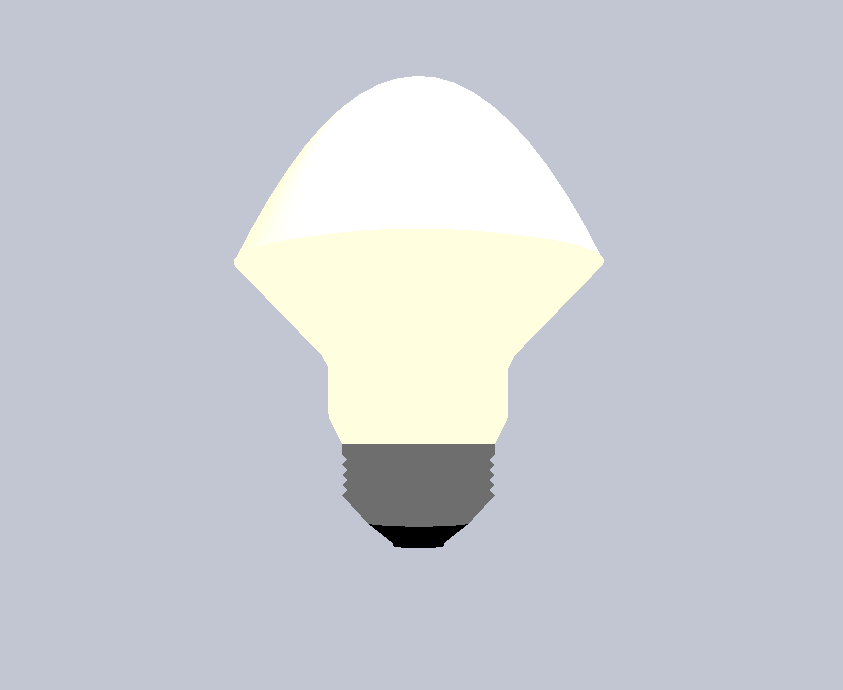

# OpenGL Lamp
A light bulb, or something quite like, using pyopengl

# Requirements

- Python 3.8+
- [Numpy](https://pypi.org/project/numpy/)
- [PyOpenGL](https://pypi.org/project/PyOpenGL/) 
- [PyOpenGL-accelerate](https://pypi.org/project/PyOpenGL-accelerate/)
- [PyGame](https://pypi.org/project/pygame/)
 
# How to run

## Using locally installed python

Install dependencies:

```shell script
pip install --user pygame numpy PyOpenGL PyOpenGL_accelerate
```

Run the main script:

```shell script
python main.py
```

## Using PipEnv

Install [PipEnv](https://pipenv.pypa.io/en/latest/) then enter the pipenv shell and run the main script:

```shell script
# enter shell
pipenv shell
# run the script
python main.py
```

## Preview

